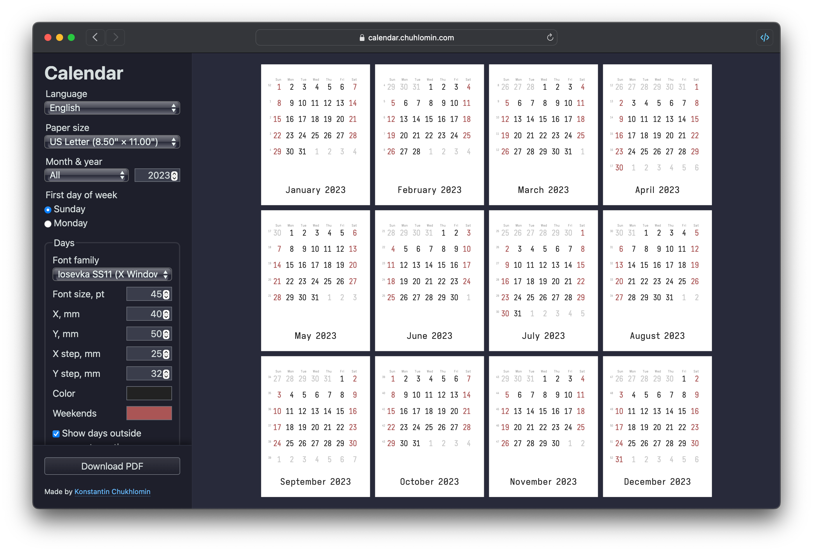

# Calendar PDF Generator

Every year I make a calendar. This year, I made a generator.

https://calendar.chuhlomin.com

Features:

- tune calenar elements (position, font, color, etc.)
- download PDF just for one month or for the whole year
- all settings (and even panel scroll position) are persisted in LocalStorage and restored on page reload
- switching language is nearly instant and doesn't require page reload
- mobile-friendly

I used [Mustache.js](https://github.com/janl/mustache.js),
[Colr Pickr](https://github.com/R-TEK/colr_pickr)
and [gofpdf](https://github.com/jung-kurt/gofpdf) for this project.

#project #calendar
