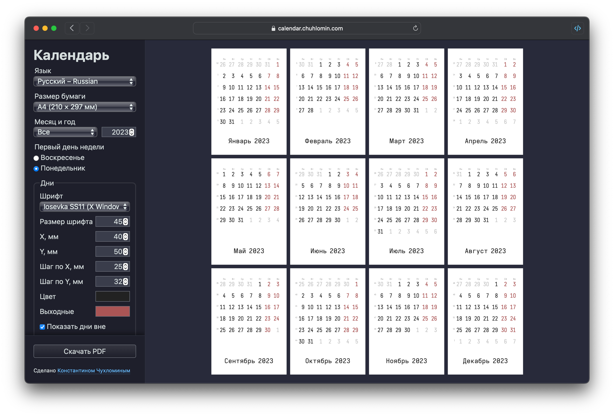

# PDF-генератор календарей

Каждый год я делаю календарь. В этом году я сделал генератор.

https://calendar.chuhlomin.com

Особенности:

- можно настроить элементы календаря (позиция, шрифт, цвет, и т.д.)
- можно скачать PDF только для одного месяца или для всего года
- все настройки (и даже положение прокрутки панели) сохраняются в LocalStorage и восстанавливаются при перезагрузке страницы
- переключение языка происходит почти мгновенно и не требует перезагрузки страницы
- адаптивный дизайн

Я использовал [Mustache.js](https://github.com/janl/mustache.js),
[Colr Pickr](https://github.com/R-TEK/colr_pickr)
и [gofpdf](github.com/jung-kurt/gofpdf) для этого проекта.

#project #calendar
