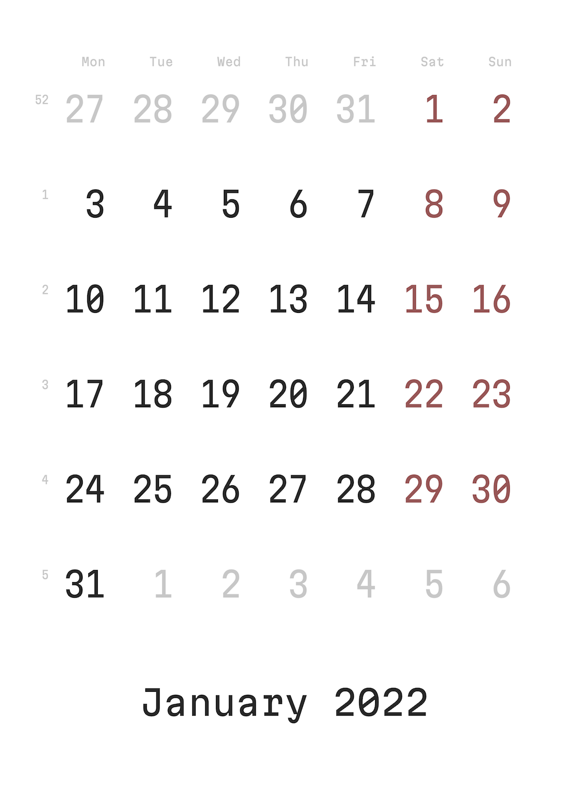

# Calendar 2022

Every new year, I make a calendar.

Instead of [Iosevka](https://github.com/be5invis/Iosevka) (OFL 1.1), this year,
I picked the fresh [Martian Mono](https://github.com/evilmartians/mono) from
[Roman Shamin](https://twitter.com/romanshamin) (art director of
[Evil Martians](https://evilmartians.com)).

Martian Mono is free. Support font development [on Patreon](https://patreon.com/romanshamin).

<a href="calendar.pdf" download="2022 Calendar.pdf">2022 Calendar.pdf</a>

#project #calendar #font
