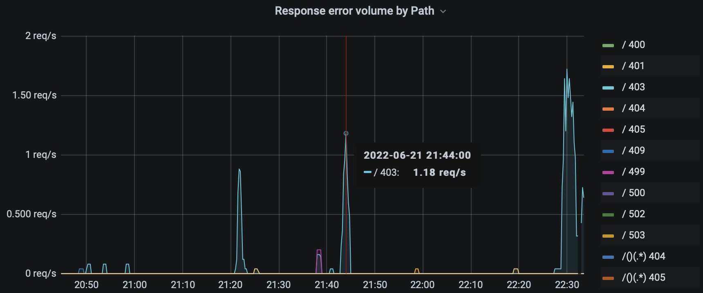

# Grafana

Grafana – это приложение с открытым исходным кодом для визуализации и анализа метрик.
Оно поддерживает множество источников данных, включая [Prometheus](../2020/prometheus_ru.md), InfluxDB и другие.

https://grafana.com

https://github.com/grafana/grafana

С момента выхода в 2014 году он превратился в довольно мощный инструмент.
Теперь с его помощью можно:

* отправлять оповещения по электронной почте, Slack, Telegram, PagerDuty, и т.д.,
* просматривать логи из Loki, Elasticsearch или CloudWatch,
* смотреть трассировки запросов из Zipkin, Jaeger или Tempo.

https://grafana.com/docs/grafana/latest/

Ближайшие альтернативы: [DataDog](https://www.datadoghq.com),
[Kibana](https://www.elastic.co/kibana/)

#ops #visualization #go
