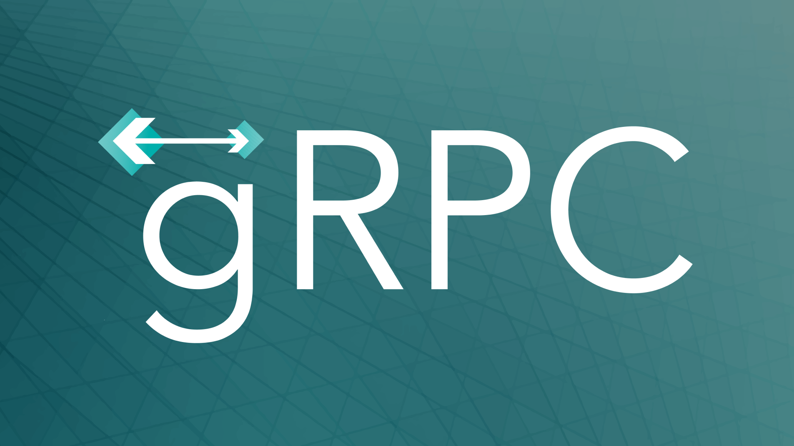
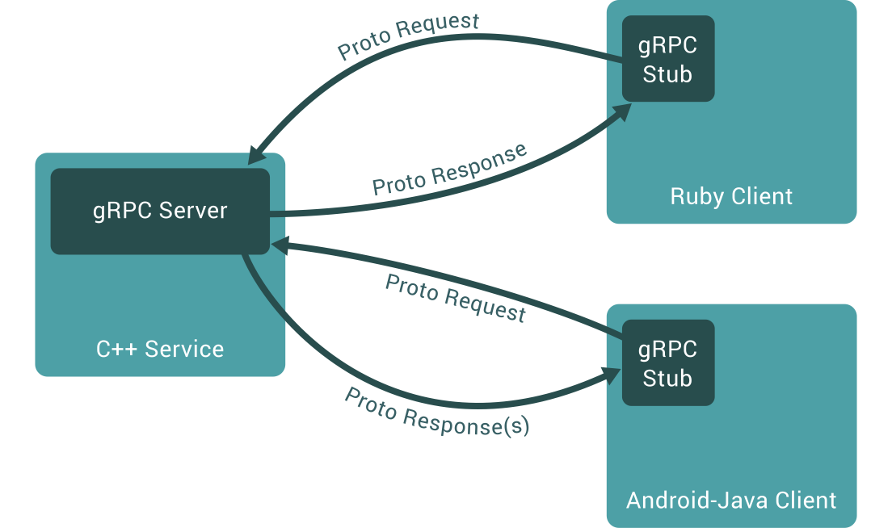

# gRPC



gRPC is a modern open source high performance RPC framework.

It was released by Google in 2016 as the next version of an internal project
called Stubby.

https://grpc.io

gRPC allows you to describe the service and generate both code for clients and
a "stub" for the server in [popular programming languages](https://grpc.io/docs/languages/).



[Protobuf](../2021/protobuf.md) is used to describe the service.
Unary "request-response" messages as well as streams of messages are supported.

```proto
service HelloService {
  rpc SayHello (HelloRequest) returns (HelloResponse);
}

message HelloRequest {
  string greeting = 1;
}

message HelloResponse {
  string reply = 1;
}
```

Can be particularly useful where there are several internal services
communicating with each other. Due to the complex use of HTTP/2,
[gRPC is not supported by browsers](https://grpc.io/blog/state-of-grpc-web/).

#proto #ops
