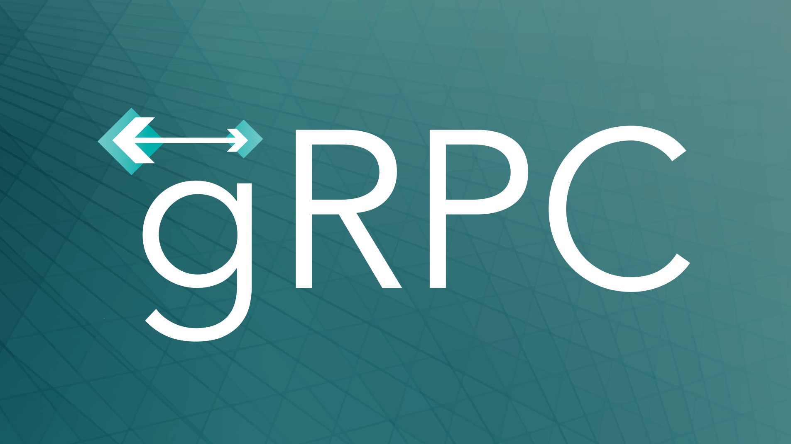

# gRPC



gRPC это современный высокопроизводительный RPC фрймворк с открытым исходным кодом.
Выпущен Google в 2016 году как продолжение внутреннего проекта под названием Stubby.

https://grpc.io

Он позволяет описать сервис и сгенерировать как код для клиентов, так и "заглушку"
для сервера на [популярных языках программирования](https://grpc.io/docs/languages/).


Для описания сервиса используется [Protobuf](/blog/2021/protobuf_ru.md). Поддерживаются стандартные (унарные)
"запросы-ответы" и потоки сообщений.

```proto
service HelloService {
  rpc SayHello (HelloRequest) returns (HelloResponse);
}

message HelloRequest {
  string greeting = 1;
}

message HelloResponse {
  string reply = 1;
}
```

Может быть особенно полезен, где есть несколько внутренных сервисов, общающихся
между собой. В виду особенностей использования HTTP/2,
[gRPC не поддерживается браузерами](https://grpc.io/blog/state-of-grpc-web/).

#proto #ops
