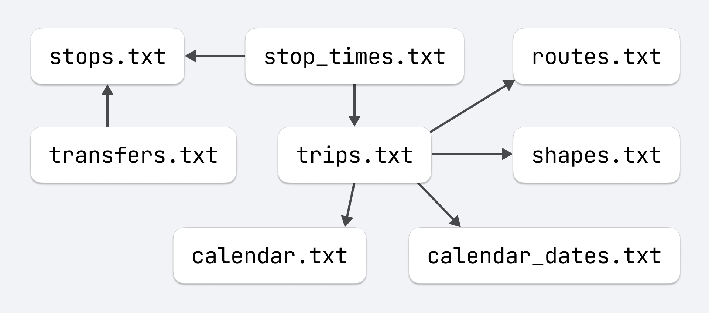

# GTFS

GTFS (General Transit Feed Specification) is an open format for describing
stop locations, schedules, etc.

https://gtfs.org

It resulted from a collaboration between Portland-based transportation
company TriMet and Google in 2005.

https://developer.trimet.org/GTFS.shtml

To popularize and control the development of the format, the company
Mobility Data was created.

https://database.mobilitydata.org

More than a thousand transportation companies provide data in this format
to developers and companies.
The data are distributed as a ZIP archive with CSV files: `stops.txt`,
`routes.txt`, `trips.txt`, `shapes.txt`, `calendar.txt`, ...

https://developers.google.com/transit/gtfs/reference

Especially curious to me is the [GTFS-Pathways](https://docs.google.com/document/d/1qJOTe4m_a4dcJnvXYt4smYj4QQ1ejZ8CvLBYzDM5IyM)
format extension (`pathways.txt`) describing the multi-level stations, transfers, and boarding zones.

#transit #geo
