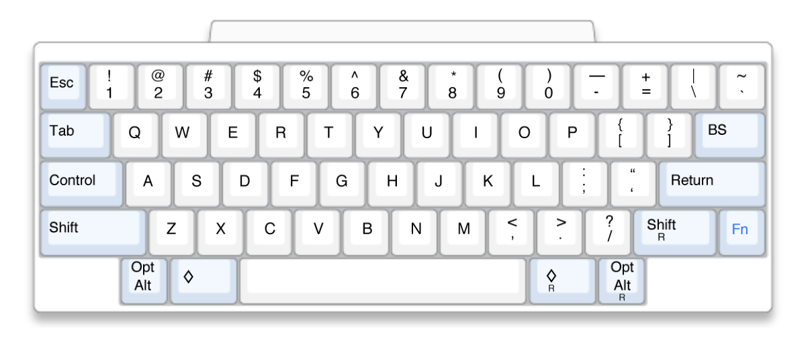

# HHKB

В 1996 году японский профессор Eiiti Wada создал Happy Hacking Keyboard –
минималистичную клавиатуру с 60-ю клавишами.
Производится в Японии PFU Limited, дочерней компании Fujitsu.

https://hhkeyboard.us

Дизайн клавиатуры вдохновлён клавиатурой первого Макинтош 128k: отсутсвтуют
функциональные клавиши и клавиши управления курсором, <kbd>Control</kbd> на
месте <kbd>CapsLock</kbd>.

Это не значит что на ней нельзя управлять курсором, нажать <kbd>F2</kbd>, или
менять громкость – эти функции выполняют существующие клавижи при зажатой
клавише <kbd>Fn</kbd>.

Текущее поколение HHKB Professional Series может либо подлючаться по USB Type-C,
либо по Bluetooth, работает от двух пальчиковых батареек и помнит до 4-х устройств.

От большинства механических клавиатур HHKB отличается электростатическими
ёмкостными свичами Topre. Они регистрируют нажание клавиши с помощью пружины,
расположенной непосредственно на плате, а не пропускают через себя ток.
Благодаря пружине клавиши быстрее возвращаются в исходное положение,
не дребезжат так сильно и по-другому звучат.

Если отсутвите стрелок кажется диким, посмотрите на Leopold FC660C.

#keyboard #hardware
