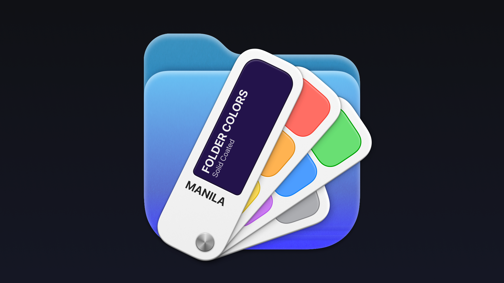

# Manila

Manila hemp, also known as abacá, is a strong fiber used in the manufacture of ropes.
Grown in the Philippines, hence the association with Manila, its capital city.

Manila paper was originally made out of old Manila hemp ropes which were
extensively used on ships. It has a buff color, same color used for folders in Windows.

[Neil Sardesai](https://twitter.com/neilsardesai) made a Finder extension that
lets you change the colors of your folders from the context menu.

> The standard blue folder is pretty nice. But have you ever wished you could
> have a red folder? Or green? Or maybe even purple? Well, now you can —

https://github.com/neilsardesai/Manila

<video controls>
  <source src="manila.mp4" type="video/mp4">
</video>

#app #macos
