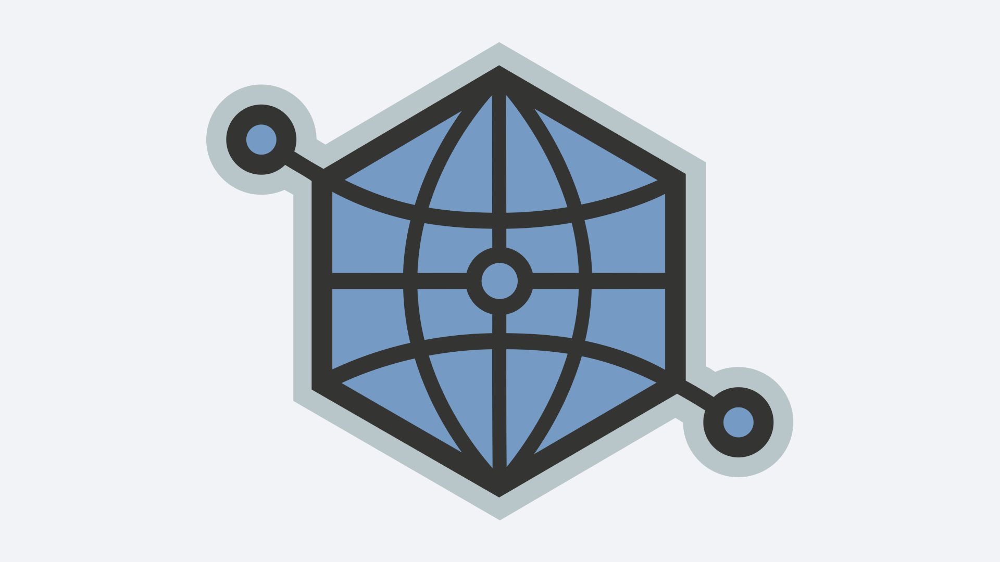

# Open Graph Protocol



Open Graph is a protocol designed to influence what a link should look like,
when it is shared on the Internet.

https://ogp.me

Using special HTML `meta` tags you can specify title, description, picture
and other information about the page.

All posts on this blog now have these tags. For example, for this page they
look like this:

```html
<meta property="og:type" content="article" />
<meta property="og:url" content="https://chuhlomin.com/blog/2022/ogp" />
<meta
  property="og:title"
  content="Open Graph Protocol \ Microblog \ Constantine Chukhlomin"
/>
<meta
  property="og:image"
  content="https://chuhlomin.com/blog/2022/../2022/ogp.png"
/>
<meta property="article:author" content="https://chuhlomin.com" />
<meta property="article:published_time" content="2022-05-21" />
<meta property="article:tag" content="blog" />
```

A few useful tools:

- [Link Preview](https://linkpreview.xyz/)
- [Open Graph Debugger/Simulator](https://en.rakko.tools/tools/9/)
- [Open Graph Generator](https://webcode.tools/generators/open-graph)
- [About Twitter Cards](https://developer.twitter.com/en/docs/twitter-for-websites/cards/overview/abouts-cards)
- [Twitter Card Preview Tool](https://www.bannerbear.com/tools/twitter-card-preview-tool/)
- [Facebook Preview Tool](https://www.bannerbear.com/tools/facebook-open-graph-preview-tool/)

#blog
