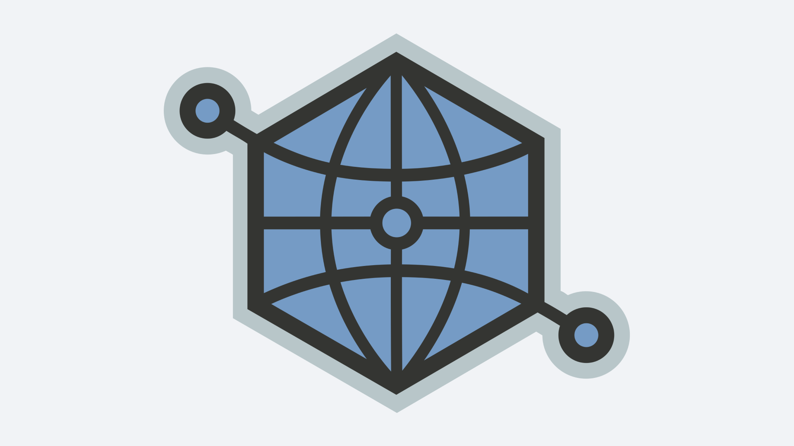

# Open Graph Protocol



Open Graph это протокол, призванный повлиять на то как должна выглядеть ссылка,
когда ей делятся в интернете.

https://ogp.me

С помощью специальных HTML `meta`-тегов можно задать заголовок, описание,
картинку и другую информацию о странице.

Теперь все посты в этом блоге имеют эти теги. Например, для этой страницы они
выглядят так:

```html
<meta property="og:type" content="article" />
<meta property="og:url" content="https://chuhlomin.com/blog/2022/ogp?lang=ru" />
<meta
  property="og:title"
  content="Open Graph Protocol \ Микроблог \ Константин Чухломин"
/>
<meta property="og:image" content="https://chuhlomin.com/blog/2022/ogp.png" />
<meta property="article:author" content="https://chuhlomin.com" />
<meta property="article:published_time" content="2022-05-21" />
<meta property="article:tag" content="blog" />
```

Несколько полезных инструментов:

- [Link Preview](https://linkpreview.xyz/)
- [Meta Tags Toolkit](https://metatags.io/)
- [Open Graph Debugger/Simulator](https://en.rakko.tools/tools/9/)
- [Open Graph Generator](https://webcode.tools/generators/open-graph)
- [About Twitter Cards](https://developer.twitter.com/en/docs/twitter-for-websites/cards/overview/abouts-cards)
- [Twitter Card Preview Tool](https://www.bannerbear.com/tools/twitter-card-preview-tool/)
- [Facebook Preview Tool](https://www.bannerbear.com/tools/facebook-open-graph-preview-tool/)

Бонус: [Подборка OG-изображений](https://www.ogimage.gallery/)

#blog
