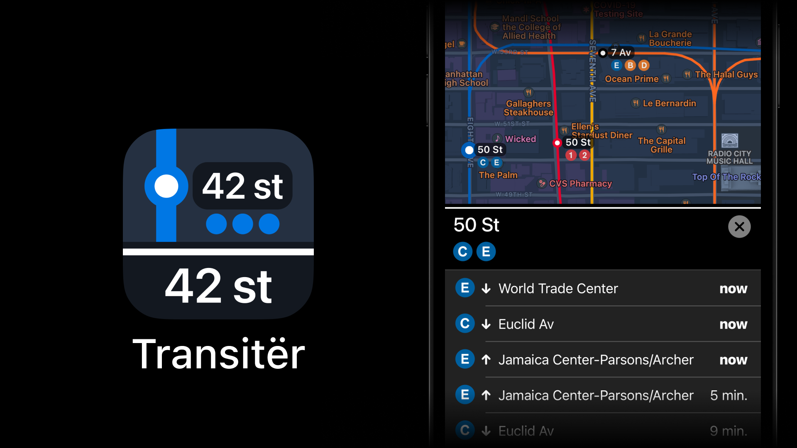

# Transitër

В 2019 я написал приложение для iOS – Transit Ninja.
Идея простая: на карте видно расположение ближайших остановок автобусов и станций метро.
Нажимаешь на иконку – и видишь какие автобусы или поезда скоро будут.

В том же 2019 году Apple анонсировала [SwiftUI](https://developer.apple.com/xcode/swiftui/)
– новый способ создания интерфейсов приложений.

Мне понадобилось месяца 4 чтобы переписать приложение на SwiftUI.

Промо-сайт: https://transiter.app

Приложение работает только для метро и автобусов Нью-Йорка, и поездов Нью-Джерси.

https://apps.apple.com/us/app/transitër/id1472885958

#project #app #ios #transit #app
