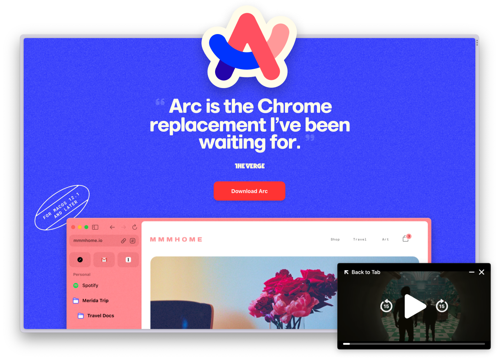

# Arc Browser

Arc Browser is out of beta and is now available without invites. I recommend trying it.

https://arc.net/

Unlike other Chromium-based browsers, Arc has a different approach to working
with tabs and bookmarks. They are arranged vertically, making them look like
unsorted mail.

https://arc.net/welcome-to-arc

Arc also offers:

* [Boost](https://arc.net/boosts) — customize your own CSS styles and JS scripts
  that will be synchronized between devices. For example, you can easily hide
  annoying elements on websites.
* Focus Mode – a mode in which only a small frame remains around the open page.
* Split View – split the browser window vertically or horizontally into two
  (three, four) parts.
* Easels – an infinite "canvas" where you can insert fragments of sites.

#app #macos
