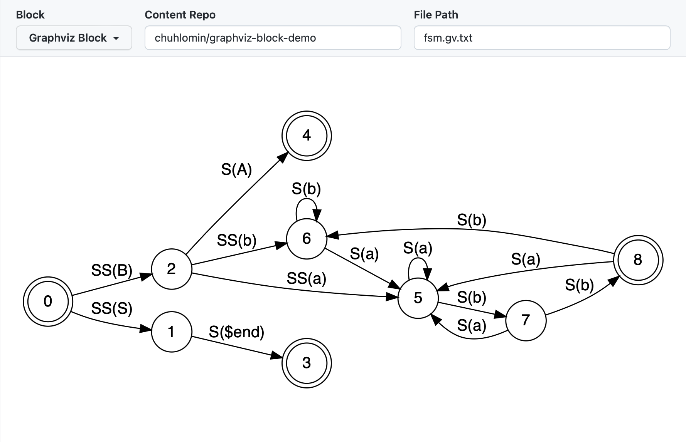

# GitHub Blocks

GitHub запустил новую платформу Blocks в экспериментальном техническом превью.
Блоки влияют на то как GitHub должен отобразить файл или каталог. Вы можете выбрать из списка доступных блоков или создать свой собственный. Технически они работают как компоненты React JSX (или TSX), отображаемые в iFrame. Такие блоки можно встраивать в любой Markdown файл.

https://blocks.githubnext.com

Я сделал простой блок для отображения файлов Graphviz DOT.
Он использует пакет [graphviz-wasm](https://github.com/fabiospampinato/graphviz-wasm/) чтобы запустить Graphviz в браузере (WASM порт 🤯). Если у вас есть доступ к техническому превью, [посмотрите на это в действии](https://blocks.githubnext.com/chuhlomin/graphviz-block-demo/blob/main/README.md).

https://github.com/chuhlomin/graphviz-block

#github #project
