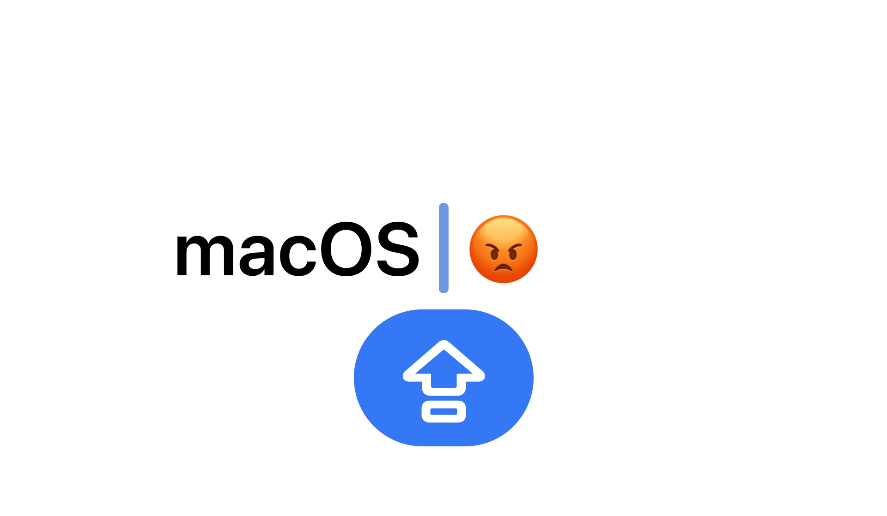

# macOS cursor redesign



For years now, I've been using my [own layout](https://github.com/chuhlomin/birminitsa),
with Russian on the Caps Lock layer.
(Why don't I use the Caps Lock or 🌐 key to switch layouts?
Because it works every once in a while.)

In macOS Sonoma, they added an indicator for the current layout and Caps Lock on for some reason.
It's inexplicable why this feature can't be disabled in the settings.

It's good that it can still be disabled through the terminal:

```bash
sudo defaults write \
    /Library/Preferences/FeatureFlags/Domain/UIKit.plist \
    redesigned_text_cursor \
    -dict-add Enabled \
    -bool NO
```

But even here Apple engineers didn't make it work immediately — you have to reboot.

#advice #macos
