# Mermaid


Mermaid is a diagramming and charting tool.
It renders Markdown-inspired text definitions into diagrams.

http://mermaid.js.org/

Since 2022, [GitHub renders Mermaid](https://github.blog/2022-02-14-include-diagrams-markdown-files-mermaid/) diagrams in Markdown files – a great way to document your architecture. For example, this text:
<br>

    ```mermaid
    graph LR;
        Service--Webhook-->APIGateway[API Gateway];
        subgraph "AWS"
            APIGateway-->Lambda[Lambda];
            Lambda-->DynamoDB[(DynamoDB)];
        end
    ```

Renders as:



Here is a list of the diagrams and charts that can be defined with Mermaid:

* Flowcharts
* Sequence diagrams
* Class diagrams
* ER diagrams
* State diagrams
* Gantt
* Pie charts
* Git graphs
* User journey
* C4
* Mindmap
* Timeline
* ZenUML sequence diagrams
* Sankey
* XY charts

There is also a [command line tool](https://github.com/mermaid-js/mermaid-cli)
to convert `.mmd` files to `.svg` or `.png`:

```bash
mmdc -i input.mmd -o output.svg
```

Check out a [VSCode extension](https://marketplace.visualstudio.com/items?itemName=bierner.markdown-mermaid) that adds Mermaid support to the built-in Markdown preview.

#visualization
