# Mermaid


Mermaid это инструмент для создания диаграмм и графиков.
С его помощью можно создавать диаграммы, используя текстовое описание.

http://mermaid.js.org/

С 2022 года [GitHub поддерживает Mermaid](https://github.blog/2022-02-14-include-diagrams-markdown-files-mermaid/)
диаграммы в Markdown файлах – это отличный способ документировать архитектуру.
Например, этот текст:


    ```mermaid
    graph LR;
        Service--Webhook-->APIGateway[API Gateway];
        subgraph "AWS"
            APIGateway-->Lambda[Lambda];
            Lambda-->DynamoDB[(DynamoDB)];
        end
    ```

Отрисуется так:



Вот список диаграмм и графиков, которые можно создать с помощью Mermaid:

* Flowcharts
* Sequence diagrams
* Class diagrams
* ER diagrams
* State diagrams
* Gantt
* Pie charts
* Git graphs
* User journey
* C4
* Mindmap
* Timeline
* ZenUML sequence diagrams
* Sankey
* XY charts

Также есть [утилита командной строки](https://github.com/mermaid-js/mermaid-cli)
для конвертации `.mmd` файлов в `.svg` или `.png`:

```bash
mmdc -i input.mmd -o output.svg
```

Посмотрите [расширение для VSCode](https://marketplace.visualstudio.com/items?itemName=bierner.markdown-mermaid),
которое добавляет поддержку Mermaid во встроенный просмотр Markdown.

#visualization
