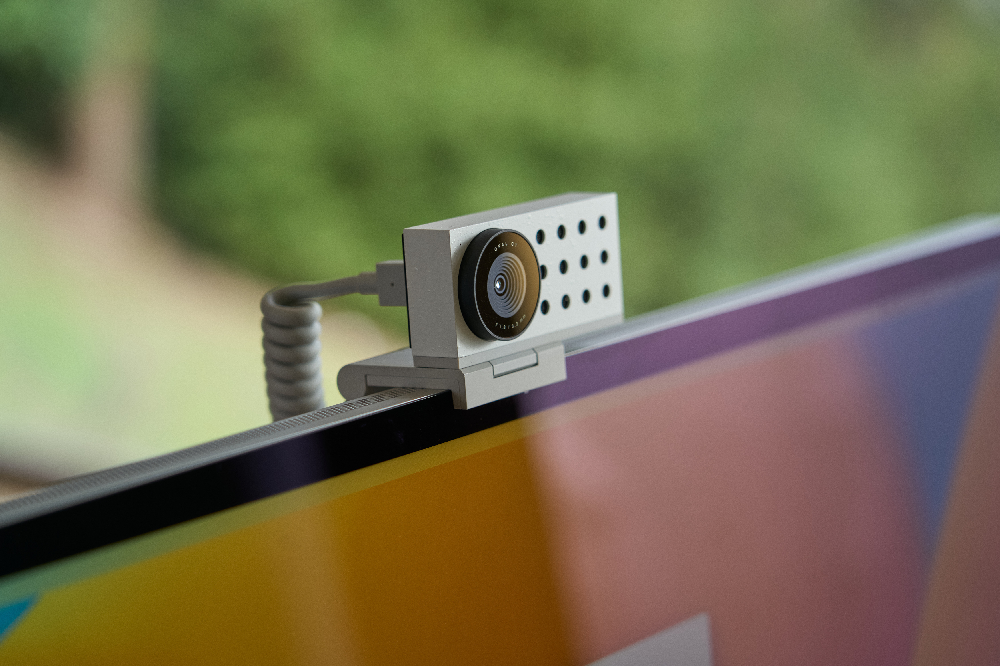

# Opal C1

When the pandemic started, I seriously considered buying a webcam —
after a long day of calls, the built-in camera on my MacBook gave me a neck ache.
I needed a camera that mounts to an external monitor.

Several coworkers with Logitech cameras had a strange bug where the camera would
change the angle of view when they started talking.
After a long search, I settled on the Opal C1.

https://opalcamera.com ($250)

On the downside — this camera gets warm even when not in use.
And using it, even newer Macbooks with Apple Silicon get very warm.
However, it can be forgiven for the quality of the picture — it's just amazing.

The camera is connected via USB-C.
The companion app adjusts the focal length, zoom, color scheme, overlays, etc.

#hardware
