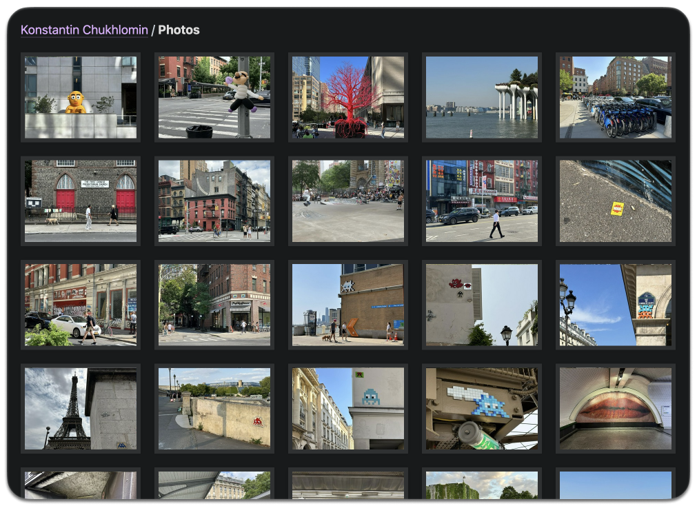

# Photos

Usually, I post photos on Instagram, but I've been increasingly dissatisfied with it:
the algorithmic feed, the stories, and the ads. Luckily, it's still possible to
[download photos from Instagram](https://www.instagram.com/download/request).

I decided to make a minimalistic photo gallery.
The main requirement is that the gallery should work fast on mobile and desktop.

http://chuhlomin.com/photos

[The Photographer app](https://github.com/chuhlomin/chuhlomin.com/tree/main/photographer)
takes a folder of photos and generates thumbnails, blurs, and other metadata stored in a YAML file.
The same file is later used by the site generator to "render" the HTML page.
Here are some of the features:

* Photos are stored in Cloudflare R2 storage for fast delivery (and to avoid paying for traffic).
* Images are preloaded in the background.
* Some photos have captions.
* Sprites are used to reduce the number of requests.
* A blurred image is shown before the photo is loaded.
* Keyboard navigation.

What else would I like to add:

* tags,
* location information,
* display of photos on the map,
* search by description.

#project #go #image
