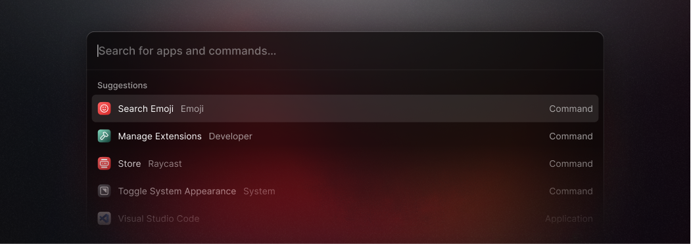

# Raycast

Raycast это расширяемый лаунчер, отличная альтернатива Alfred, Spotlight и другим лаунчерам.

https://www.raycast.com

Я пользовался Alfred несколько лет, но перешел на Raycast по следующим причинам.

- [История буфера обмена](https://manual.raycast.com/core), синхронизируется между устройствами, бесплатно.
- [Предстоящие встречи](https://manual.raycast.com/calendar) в панели меню, присоединяйтесь одним кликом.
- [Сниппеты](https://manual.raycast.com/snippets). Вы можете настроить так, чтобы если вы наберете `{ts}` в любом месте, он будет заменен на текущую метку времени. Также посмотрите [ray.so/snippets](https://ray.so/snippets).
- Плавающая заметка, которая остаются поверх всех окон и отлично подходят для записи ежедневных дел или записи заметок о встрече.
- [Управление системными настройками](https://manual.raycast.com/system), такими как внешний вид системы, громкость и другие.
- [Управление окнами](https://manual.raycast.com/window-management), такими как перемещение окон в левую или правую половину экрана.

Попробуйте и пройдите обучение. Это отличное приложение.

https://github.com/raycast

#app #macos #timestamp #alfred
