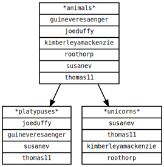

# Teams

When your GitHub organization has a plenty of people, you may want to organize them into teams.
Over time, it may become difficult to track who is in which team and what is teams hierarchy.

I made a simple tool to help you with that.  
https://github.com/chuhlomin/teams

It is a simple command line tool that reads your GitHub organization members and teams and outputs a graph in [Graphviz](../2020/graphviz.md) format.

Unfortianately, GitHub API does not provide a way to tell if a user is a only a member of a child team, and not a member of a parent team.

#project #go #github
