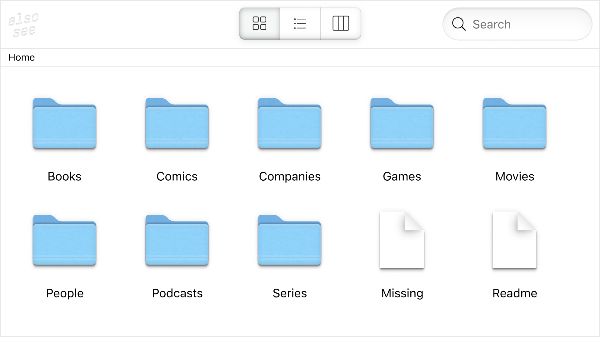

# Also, see

It's time to tell about the side project I have worked on for the last few months. It's called "Also, see", a system for describing and connecting things. It's a bit like a wiki but with a focuses on the relationships between things: games, movies, books, people, etc.

https://alsosee.info

The interface is inspired by the Finder in macOS. It's been quite a challenge to make it work in a web browser (with keyboard navigation) as a static website with no backend.

All code is open source and available on GitHub: https://github.com/alsosee/.
Content used to build the site lives in [info](https://github.com/alsosee/info) repository as YAML files. Most of the images live in [media](https://github.com/alsosee/media) repository, and [thumbnailer](https://github.com/alsosee/thumbnailer) takes care of creating sprite images to minimize the number of requests and optimize loading times. Self-hosted [MeiliSearch](https://www.meilisearch.com/) powers search.

What do you think?

#project #go
