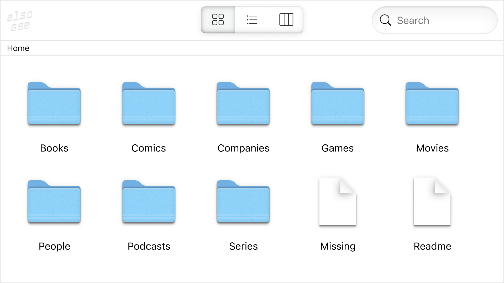

# Also, see

Пришло время рассказать о пет-проекте, над которым я работал в последние несколько месяцев. Он называется "Also, see", и это система для описания разных вещей и их связей. Это что-то вроде вики, но с упором на связи между вещами: играми, фильмами, книгами, людьми и т.д.

https://alsosee.info

Интерфейс вдохновлен Finder в macOS. Было непросто сделать его веб-версию (с клавиатурной навигацией) как статический сайт без бэкенда.

Код открыт и доступен на GitHub: https://github.com/alsosee/.
Контент, используемый для построения сайта, находится в репозитории [info](https://github.com/alsosee/info) в виде YAML-файлов. Большинство изображений находится в репозитории [media](https://github.com/alsosee/media), и [thumbnailer](https://github.com/alsosee/thumbnailer) занимается созданием спрайтов, чтобы минимизировать количество запросов и оптимизировать время загрузки. Поиск работает на [MeiliSearch](https://www.meilisearch.com/).

Что думаете?

#project #go
