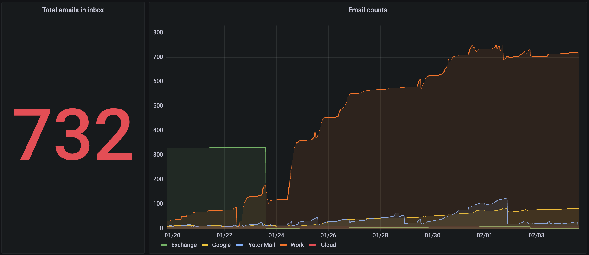

# Email Counter

About half a year ago, I made a small application in Go that uses AppleScript to get the number of emails in the mailbox and publishes the result to the Prometheus Push Gateway to display these metrics in Grafana.

To my great surprise, I found that this application still runs every hour and works. I even forgot that I have it. Well, since it works, I decided to publish it on GitHub:

https://github.com/chuhlomin/email-counter

#go #macos #project
