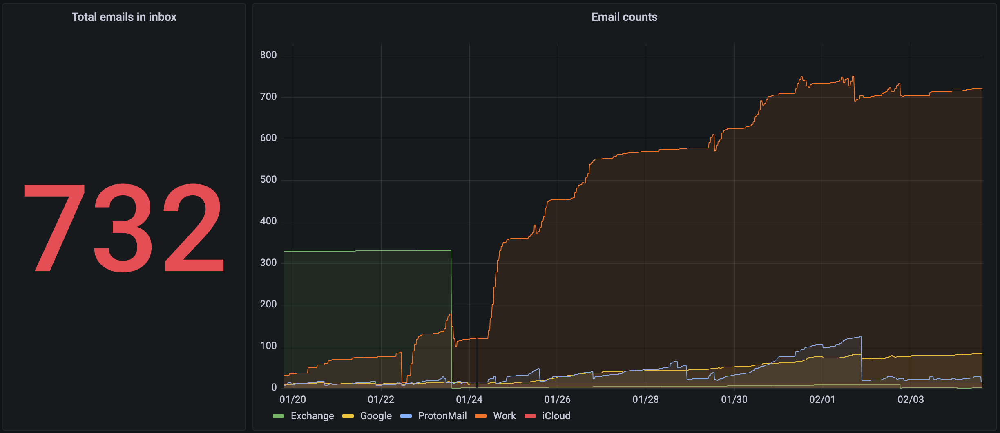

# Email Counter

Больше полугода назад я сделал небольшое приложение на Go, которое использует AppleScript для получения количества писем в почтовом ящике и публикует результат в Prometheus Push Gateway, чтобы потом отобразить эти метрики в Grafana.

С большим удивлением обнаружил, что это приложение всё ещё запускается каждый час и работает. Даже забыл, что оно у меня есть. Ну раз уж оно работает, решил опубликовать на GitHub:

https://github.com/chuhlomin/email-counter

#go #macos #project
