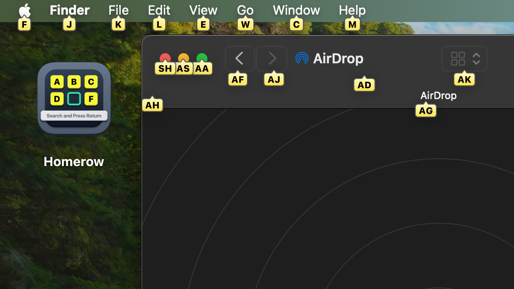

# Homerow

Fans of keyboards, will love this app. Once activated by a hotkey
(<kbd>⌘</kbd>+<kbd>⇧</kbd>+<kbd>Space</kbd> by default),
it highlights elements on the screen, and you can "click" on them by typing the highlighted letters.
It's like [Vimium](https://vimium.github.io/) or
[Surfingkeys](https://github.com/brookhong/Surfingkeys), but for entire MacOS.
Of course, it's not working for non-native apps.

https://www.homerow.app/

Homerow can be evaluated for free, but please consider buying it if you find it useful. A one time purchase of &#36;29 for one device, &#36;39 for two, or &#36;49 for three.

Alternatives: https://shortcat.app/, https://superkey.app/

Also recommend [Key extension for Safari](https://apps.apple.com/us/app/keys-for-safari/id1494642810).

#app #macos #keyboard
