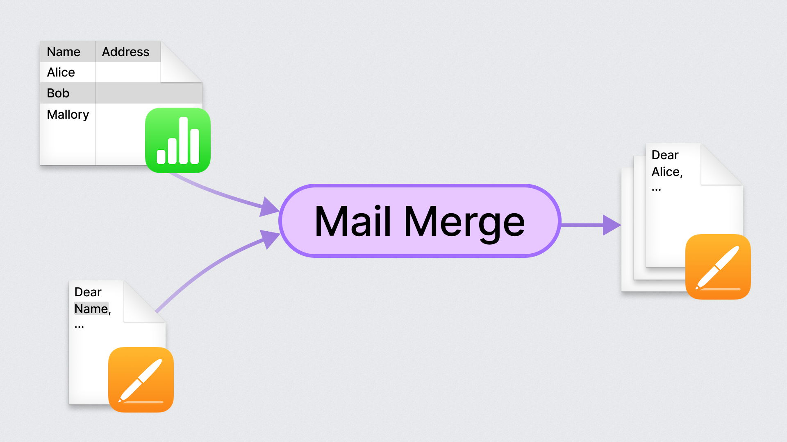

# Mail Merge

В Apple Pages есть встроенная функция Mail Merge.
Несмотря на название, она вовсе не связана с приложением Mail.
Вместо этого она, выступает в роли мощного шаблонизатора, позволяющего с невероятной легкостью создавать персонализированные документы в массовом порядке.
Находится она в конце панели "Document" в Pages.

Вот как это работает:
Вначале создаете таблицу в Numbers, где каждый столбец представляет собой поле (например, Имя, Адрес), а каждая строка соответствует отдельному документу.
В Pages настраиваете связь с таблицей, используете доступные "поля", нажимаете Mail Merge, и вуаля – Pages создаст новый документ где будут копии вашего шаблона с данными из таблицы.

Особенно полезно, когда нужно заполнить несколько форм, которые похожи, но не идентичны по данным.

#macos #advice
