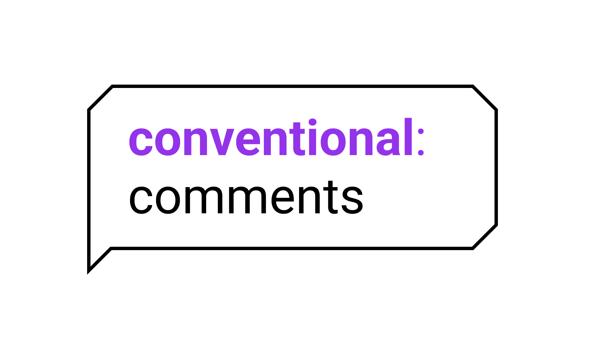

# Соглашение о комментариях



Соглашение о комментариях — это небольшое соглашение для написания комментариев любого рода
(ревью кода, документов и т. д.) в последовательной и конструктивной манере.

https://conventionalcomments.org/

Формат следующий:

```
<label> [decorations]: <subject>

[discussion]
```

где decorations и discussion необязательны.

Примеры комментариев, которые следуют этому соглашению:

- suggestion(non-blocking): rename variable to `user_id`

  This will make it consistent with other parts of the codebase.

- question: Why are we using a linked list here?
- issue: This function has a time complexity of O(n^2).
- nitpick: Consider using `const` instead of `let` for this variable.
- praise: Great job on implementing the new feature!
- todo: We need to add error handling here.
- note: This part of the code is critical for performance.
- typo: "recieve" should be "receive".

#github
