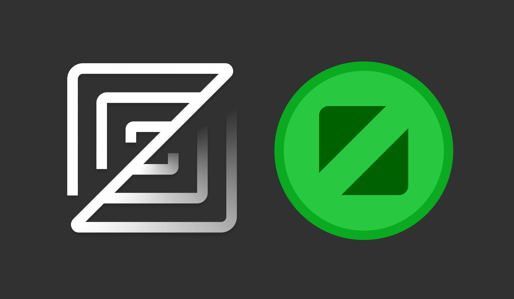

# Fullscreen

Fullscreen mode in MacOS (<kbd>Cmd</kbd>+<kbd>Ctrl</kbd>+<kbd>F</kbd> or the green button in the corner of the window) is a convenient way to focus on your work.
The app takes up the entire screen, and the Dock and menu bar are hidden.

When working with VSCode, this mode is easy to use thanks to native tabs - just set one of them to fullscreen and merge all the windows.
However, Zed, which I currently use, [does not support](https://github.com/zed-industries/zed/issues/4948) native tabs yet.

When I have many Zed windows open (11 at the time of writing), manually setting them all to fullscreen is inconvenient.
So I wrote a script that automatically sets all open Zed windows to fullscreen.

[zed-fullscreen.scpt](https://gist.github.com/chuhlomin/58a5f569d1706a15439ab5f09465c642)

It can be launched with the command `osascript zed-fullscreen.scpt` or can be imported into [Apple Shortcut](https://www.icloud.com/shortcuts/5f8bfe286d8b47d3b9d442b3bf731cee).

<small>Note: For this script to work, you must grant `osascript` (and the app you are running it from), Shortcuts (plus Constrol Center and Script Editor) permissions in System Preferences → Privacy & Security → Accessibility.</small>

#macos
