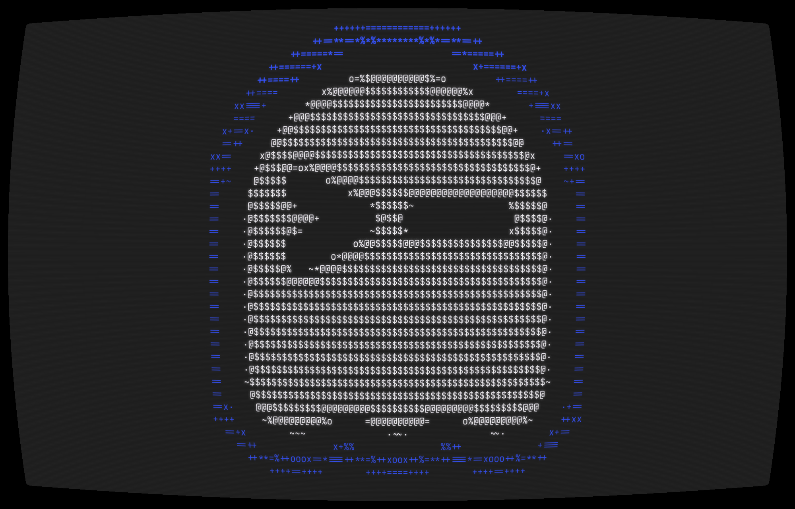
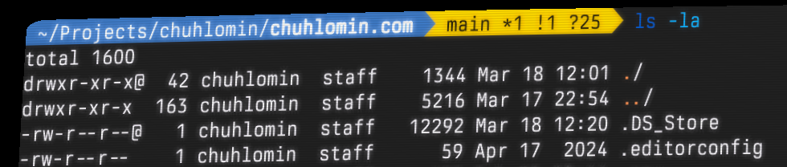

# Ghostty

Многие уже наверняка слышали о Ghostty, относительно новом эмуляторе терминала, который набирает популярность.
Он отличается исключительной скоростью, легкостью и разумными настройками по умолчанию.

https://ghostty.org

У Ghostty нет графического интерфейса настроек. Вместо этого он настраивается через файл конфигурации.

Вот мой конфиг

<pre><code>font-family = "TX-02 Condensed"
font-size = 15

copy-on-select = false
window-save-state = always
shell-integration-features = no-cursor

cursor-opacity = 0.8
cursor-style = block
cursor-style-blink = true
cursor-color = #d6d6d6

keybind = ctrl+ц=text:\x03
keybind = super+backspace=text:\x15

theme = Monokai Pro Spectrum
background = #222222
foreground = #f7f1ff
selection-background = #525053
selection-foreground = #f7f1ff
cursor-color = #bab6c0
palette = 0=#222222
palette = 1=#fc618d
palette = 2=#7bd88f
palette = 3=#fce566
palette = 4=#fd9353
palette = 5=#948ae3
palette = 6=#5ad4e6
palette = 7=#f7f1ff
palette = 8=#69676c
palette = 9=#fc618d
palette = 10=#7bd88f
palette = 11=#fce566
palette = 12=#fd9353
palette = 13=#948ae3
palette = 14=#5ad4e6
palette = 15=#f7f1ff

custom-shader = <path to shaders dir>/bloom.glsl
custom-shader = <path to shaders dir>/bettercrt.glsl
</code></pre>

Если вам нужна помощь с настройкой, есть [неофициальный инструмент конфигурации](https://ghostty.zerebos.com/) и [официальная справочная документация](https://ghostty.org/docs/config/reference).

Ghostty поддерживает шейдеры, которые можно накладывать друг на друга.
В конфигурации выше я использую эффекты свечения и CRT-монитора.

https://github.com/chuhlomin/ghostty-shaders

#cli #app
