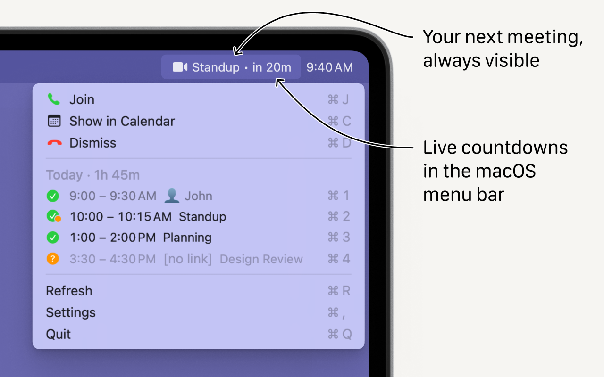

# Meeting Alerter

Очень не люблю опаздывать на онлайн созвоны. Я перепробовал несколько разных приложений, но каждое в чём-то не устроило, и написал своё. Основная идея в том, чтобы показывать _и_ время до начала следующего митинга в строке меню macOS, _и_ окно когда эта встреча начинается.

Работа над этим приложением началась пару лет назад. Сначала хотел выпустить его только с поддержкой Apple Calendar, но EventKit не даёт доступа к прикреплённым документам событий из Google Calendar, поэтому пришлось добавить интеграцию и с Google Calendar напрямую.

С помощью LLM, наконец довёл приложение до релиза.

https://meeting-alerter.app/

#app #macos #project
