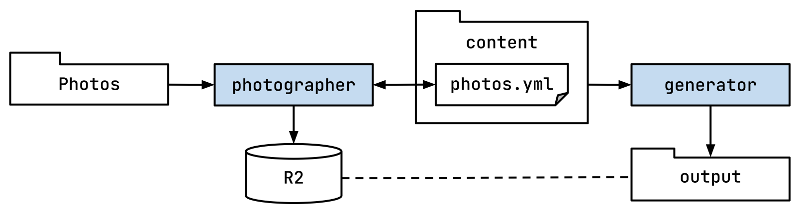

# photographer

App that handles processing photos.

It goes over the photos in the Photos directory,
uploads photos to Cloudflare R2 storage,
generates thumbnails sprites and updates `photos.yml` file,
which later is used by the `generator` to generate the static site.



## Usage

From the root of the project run:

```bash
make photographer arguments="--titles-file=/Users/user/Pictures/Photos/titles.yml"
```

## Arguments

| Argument                  | Env var                 | Description                       | Default              |
|---------------------------|-------------------------|-----------------------------------|----------------------|
| `--yaml-file`             | `YAML_FILE`             | Path to the yaml file             | `content/photos.yml` |
| `--photos-dir`            | `PHOTOS_DIR`            | Path to the photos dir            | `~/Pictures/Photos`  |
| `--r2-account-id`         | `R2_ACCOUNT_ID`         | Cloudflare account ID             |                      |
| `--r2-access-key-id`      | `R2_ACCOUNT_KEY_ID`     | Cloudflare access key ID          |                      |
| `--r2-access-key-secret`  | `R2_ACCOUNT_KEY_SECRET` | Cloudflare access key secret      |                      |
| `--r2-bucket`             | `R2_BUCKET`             | Cloudflare bucket to store photos |                      |
| `--titles-file`           | `TITLES_FILE`           | Path to the titles file           | `./titles.yml`       |
| `--force-thumbnails`      |                         | Force generating thumbnails       | `false`              |
| `--force-blurhash`        |                         | Force generating blurhash         | `false`              |
| `--force-blurhash-images` |                         | Force generating blurhash         | `false`              |

